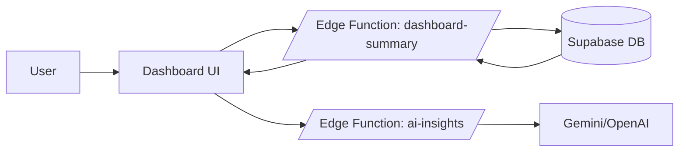
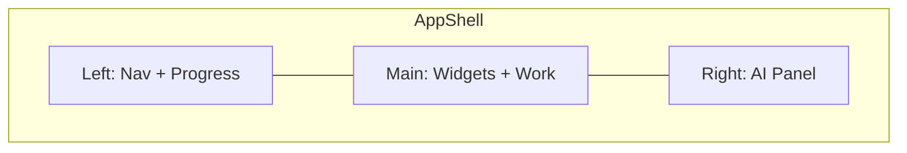
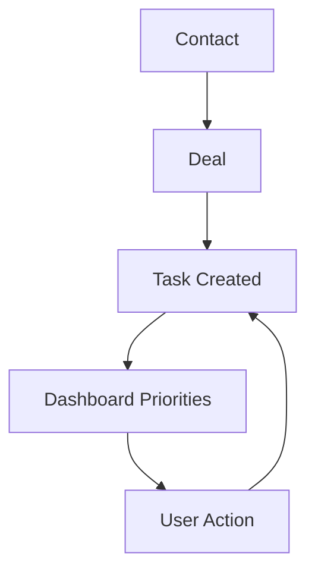

# StartupAI Dashboard — Implementation Overview

## Purpose
Build a founder-focused AI operating system dashboard that transforms **Idea → Clarity → Execution → Fundraising** in ~30 minutes.

## Goals
- Immediate value on first login (Top 3 priorities, metrics, AI guidance)
- Three-panel layout: Context | Work | Intelligence
- Supabase-powered with org-isolated RLS
- Server-side AI via Edge Functions

## Progress Tracker

| Phase | Status | Description |
|-------|--------|-------------|
| Phase 1 | ✅ DONE | Foundation (Auth, Layout, Routes) |
| Phase 2 | 🔲 TODO | Data Layer (Schema, Types, RLS) |
| Phase 3 | 🔲 TODO | Edge Functions (Dashboard Brain) |
| Phase 4 | ✅ DONE | Dashboard UI (Widgets, Panels) |
| Phase 5 | 🔲 TODO | Task System (5-Step Workflow) |
| Phase 6 | 🔲 TODO | CRM Integration (Contacts, Deals) |
| Phase 7 | 🔲 TODO | AI Panel (Intelligence Layer) |
| Phase 8 | 🔲 TODO | Polish (Empty States, Seed Data) |

### Last Updated: 2026-01-13

## Architecture Diagrams

### Dashboard Data Flow


### Three-Panel Layout


### CRM → Tasks → Dashboard Loop


## Documentation Index

1. [Phase 1: Foundation](./01-phase-foundation.md)
2. [Phase 2: Data Layer](./02-phase-data-layer.md)
3. [Phase 3: Edge Functions](./03-phase-edge-functions.md)
4. [Phase 4: Dashboard UI](./04-phase-dashboard-ui.md)
5. [Phase 5: Task System](./05-phase-task-system.md)
6. [Phase 6: CRM Integration](./06-phase-crm.md)
7. [Phase 7: AI Panel](./07-phase-ai-panel.md)
8. [Phase 8: Polish & Launch](./08-phase-polish.md)

## Use Cases (Design Everything to Satisfy These)

### Use Case A — Founder Morning Routine
```
Login → See Top 3 Priorities → "What changed?" → Risks + Fixes → Click priority → Mark done → Dashboard updates
```

### Use Case B — Fundraising Follow-up
```
Open Pipeline → AI: "2 deals at risk" → Click deal → AI suggests follow-up → Task created → Appears in priorities
```

### Use Case C — Shipping a Milestone
```
Check Project Health → See overdue tasks → AI proposes replan → Accept → Tasks updated
```
