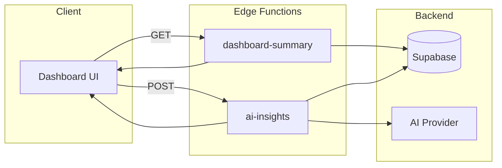

# Phase 3: Edge Functions (Dashboard Brain)

## Purpose
Server-side logic for dashboard data aggregation and AI insights.

## Goals
- Single API call to load entire dashboard
- Secure, validated, org-isolated data
- AI insights without exposing keys client-side

---

## Edge Functions Overview



---

## Function 1: dashboard-summary

### Endpoint
`GET /functions/v1/dashboard-summary`

### Purpose
Returns all data needed to render the main dashboard in a single call.

### Request
```typescript
// Headers
Authorization: Bearer <jwt>
```

### Response
```typescript
interface DashboardSummaryResponse {
  success: boolean;
  data: {
    top_tasks: Task[];        // Top 3 priority tasks
    kpis: {
      mrr: number;
      arr: number;
      runway_months: number;
      active_deals: number;
      deal_pipeline_value: number;
      tasks_due_today: number;
      tasks_overdue: number;
    };
    risks: RiskItem[];        // Overdue tasks, stalled deals
    recent_activity: Activity[];
  };
  error?: string;
}
```

### Implementation Logic
```typescript
// supabase/functions/dashboard-summary/index.ts

import { serve } from "https://deno.land/std@0.168.0/http/server.ts"
import { createClient } from 'https://esm.sh/@supabase/supabase-js@2'

const corsHeaders = {
  'Access-Control-Allow-Origin': '*',
  'Access-Control-Allow-Headers': 'authorization, x-client-info, apikey, content-type',
}

serve(async (req) => {
  if (req.method === 'OPTIONS') {
    return new Response(null, { headers: corsHeaders })
  }

  try {
    // Validate auth
    const authHeader = req.headers.get('Authorization')
    if (!authHeader?.startsWith('Bearer ')) {
      return new Response(
        JSON.stringify({ success: false, error: 'Unauthorized' }),
        { status: 401, headers: { ...corsHeaders, 'Content-Type': 'application/json' } }
      )
    }

    const supabase = createClient(
      Deno.env.get('SUPABASE_URL')!,
      Deno.env.get('SUPABASE_ANON_KEY')!,
      { global: { headers: { Authorization: authHeader } } }
    )

    // Verify user
    const token = authHeader.replace('Bearer ', '')
    const { data: claims, error: authError } = await supabase.auth.getClaims(token)
    if (authError || !claims?.claims) {
      return new Response(
        JSON.stringify({ success: false, error: 'Invalid token' }),
        { status: 401, headers: { ...corsHeaders, 'Content-Type': 'application/json' } }
      )
    }

    // Fetch top tasks (RLS handles org filtering)
    const { data: topTasks } = await supabase
      .from('tasks')
      .select('*')
      .neq('status', 'completed')
      .order('priority', { ascending: true })
      .order('due_at', { ascending: true })
      .limit(3)

    // Fetch overdue tasks
    const { data: overdueTasks } = await supabase
      .from('tasks')
      .select('*')
      .neq('status', 'completed')
      .lt('due_at', new Date().toISOString())

    // Fetch active deals
    const { data: deals } = await supabase
      .from('crm_deals')
      .select('*')
      .not('stage', 'in', '("closed_won","closed_lost")')

    // Fetch tasks due today
    const today = new Date()
    today.setHours(0, 0, 0, 0)
    const tomorrow = new Date(today)
    tomorrow.setDate(tomorrow.getDate() + 1)

    const { data: tasksDueToday } = await supabase
      .from('tasks')
      .select('id')
      .neq('status', 'completed')
      .gte('due_at', today.toISOString())
      .lt('due_at', tomorrow.toISOString())

    // Build risks
    const risks = []
    
    // Overdue tasks as risks
    for (const task of overdueTasks || []) {
      risks.push({
        id: `task-${task.id}`,
        type: 'overdue_task',
        severity: task.priority === 'critical' ? 'high' : 'medium',
        title: `Overdue: ${task.title}`,
        description: `Due ${new Date(task.due_at).toLocaleDateString()}`,
        entity_id: task.id,
        entity_type: 'task',
        action_url: `/app/tasks?id=${task.id}`
      })
    }

    // Stalled deals (no touch in 7+ days)
    const stalledThreshold = new Date()
    stalledThreshold.setDate(stalledThreshold.getDate() - 7)
    
    for (const deal of deals || []) {
      if (deal.last_touch_at && new Date(deal.last_touch_at) < stalledThreshold) {
        risks.push({
          id: `deal-${deal.id}`,
          type: 'stalled_deal',
          severity: 'medium',
          title: `Stalled: ${deal.name}`,
          description: `No activity in 7+ days`,
          entity_id: deal.id,
          entity_type: 'deal',
          action_url: `/app/deals?id=${deal.id}`
        })
      }
    }

    // Calculate KPIs
    const pipelineValue = (deals || []).reduce((sum, d) => sum + (d.amount || 0), 0)

    const response = {
      success: true,
      data: {
        top_tasks: topTasks || [],
        kpis: {
          mrr: 0, // Placeholder - would come from integrations
          arr: 0,
          runway_months: 12, // Placeholder
          active_deals: deals?.length || 0,
          deal_pipeline_value: pipelineValue,
          tasks_due_today: tasksDueToday?.length || 0,
          tasks_overdue: overdueTasks?.length || 0,
        },
        risks: risks.slice(0, 5), // Top 5 risks
      }
    }

    return new Response(
      JSON.stringify(response),
      { headers: { ...corsHeaders, 'Content-Type': 'application/json' } }
    )

  } catch (error) {
    return new Response(
      JSON.stringify({ success: false, error: error.message }),
      { status: 500, headers: { ...corsHeaders, 'Content-Type': 'application/json' } }
    )
  }
})
```

---

## Function 2: ai-insights

### Endpoint
`POST /functions/v1/ai-insights`

### Purpose
Generate context-aware AI insights for the AI panel.

### Request
```typescript
interface AIInsightsRequest {
  context_type: 'dashboard' | 'task' | 'deal' | 'project';
  context_id?: string;      // Entity ID if viewing specific item
  dashboard_state?: {       // Current dashboard data for context
    top_tasks: Task[];
    risks: RiskItem[];
    kpis: DashboardKPIs;
  };
}
```

### Response
```typescript
interface AIInsightsResponse {
  success: boolean;
  data: {
    summary: string;           // 2-3 line overview
    next_steps: NextStep[];    // Actionable items
    risks: AIRisk[];           // AI-identified risks
    reasoning?: string;        // Why these suggestions
  };
  error?: string;
}

interface NextStep {
  id: string;
  title: string;
  description: string;
  action_type: 'create_task' | 'follow_up' | 'review' | 'generate';
  action_payload?: Record<string, any>;
  priority: number;
}

interface AIRisk {
  title: string;
  severity: 'high' | 'medium' | 'low';
  recommendation: string;
}
```

### Implementation Notes
- Use GEMINI_API_KEY or OPENAI_API_KEY from secrets
- Build context-rich prompts based on dashboard state
- Keep responses structured (JSON mode)
- Cache common patterns (e.g., empty state suggestions)

---

## Config (supabase/config.toml)

```toml
[functions.dashboard-summary]
verify_jwt = false

[functions.ai-insights]
verify_jwt = false
```

---

## Success Criteria

- [ ] dashboard-summary returns data in < 500ms
- [ ] Unauthorized requests return 401
- [ ] RLS properly filters by org
- [ ] AI insights are contextually relevant
- [ ] No API keys exposed client-side
