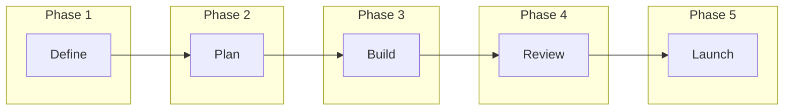

# Phase 5: Task System (5-Step Workflow)

## Purpose
Implement the universal 5-step task workflow that powers execution.

## Goals
- Tasks support phases (1-5) for workflow progression
- Categories align tasks to business areas
- AI can generate task batches
- Dashboard prioritizes intelligently

---

## 5-Step Workflow Model



### Phase Definitions

| Phase | Name | Purpose | Example Tasks |
|-------|------|---------|---------------|
| 1 | Define | Clarify goals, scope, success criteria | "Define MVP scope", "Set launch date" |
| 2 | Plan | Break down into actionable steps | "Create task breakdown", "Identify blockers" |
| 3 | Build | Execute the actual work | "Build feature X", "Write copy" |
| 4 | Review | Validate, test, iterate | "Test integration", "Get feedback" |
| 5 | Launch | Ship, announce, measure | "Deploy to production", "Send announcement" |

---

## Task Categories

| Category | Color | Use Case |
|----------|-------|----------|
| startup | blue | General startup ops |
| fundraising | gold | Investor-related |
| product | purple | Building features |
| marketing | green | GTM, content |
| operations | gray | Admin, legal, finance |
| hiring | orange | Recruiting, team |

---

## Task Prioritization Algorithm

```typescript
function calculateTaskPriority(task: Task): number {
  let score = 0;
  
  // Base priority weight
  const priorityWeights = {
    critical: 100,
    high: 75,
    medium: 50,
    low: 25
  };
  score += priorityWeights[task.priority];
  
  // Due date urgency
  if (task.due_at) {
    const daysUntilDue = differenceInDays(new Date(task.due_at), new Date());
    if (daysUntilDue < 0) score += 50;        // Overdue
    else if (daysUntilDue === 0) score += 40; // Due today
    else if (daysUntilDue <= 2) score += 30;  // Due soon
    else if (daysUntilDue <= 7) score += 15;  // This week
  }
  
  // Category boost for fundraising during raise
  if (task.category === 'fundraising' && isInFundraisingMode()) {
    score += 20;
  }
  
  // Phase progression (lower phases first)
  score += (6 - task.phase) * 5;
  
  return score;
}
```

---

## Task UI Components

### TaskList
```typescript
interface TaskListProps {
  tasks: Task[];
  groupBy?: 'phase' | 'category' | 'status' | 'due_date';
  onTaskClick: (task: Task) => void;
  onStatusChange: (taskId: string, status: TaskStatus) => void;
}
```

### TaskCard
```typescript
interface TaskCardProps {
  task: Task;
  showPhase?: boolean;
  showCategory?: boolean;
  onComplete?: () => void;
  onEdit?: () => void;
}
```

### TaskDetail (Sheet/Modal)
```typescript
interface TaskDetailProps {
  task: Task;
  onUpdate: (updates: Partial<Task>) => void;
  onDelete: () => void;
  relatedDeals?: Deal[];
  relatedContacts?: Contact[];
}
```

### TaskCreateForm
```typescript
interface TaskCreateFormProps {
  projectId?: string;  // Pre-fill if from project
  dealId?: string;     // Pre-fill if from deal
  onSubmit: (task: CreateTaskInput) => void;
  aiSuggestions?: string[];  // AI-generated task suggestions
}
```

---

## AI Task Generation

### Generate Tasks Endpoint
```typescript
// POST /functions/v1/generate-tasks
interface GenerateTasksRequest {
  context_type: 'project' | 'deal' | 'phase' | 'category';
  context_id?: string;
  phase?: TaskPhase;
  category?: TaskCategory;
  count?: number;  // Default 5
}

interface GenerateTasksResponse {
  tasks: GeneratedTask[];
}

interface GeneratedTask {
  title: string;
  description: string;
  priority: TaskPriority;
  phase: TaskPhase;
  category: TaskCategory;
  estimated_hours?: number;
}
```

### Generation Prompts

```typescript
const TASK_GENERATION_PROMPT = `
You are an AI assistant helping startup founders create actionable tasks.

Context:
- Project/Deal: {context}
- Phase: {phase}
- Category: {category}

Generate {count} specific, actionable tasks that:
1. Are concrete and completable in 1-4 hours
2. Have clear success criteria
3. Follow the 5-step workflow progression
4. Are relevant to the current context

Return as JSON array with: title, description, priority, phase, category
`;
```

---

## Task Filters & Views

### Filter Options
```typescript
interface TaskFilters {
  status?: TaskStatus[];
  priority?: TaskPriority[];
  phase?: TaskPhase[];
  category?: TaskCategory[];
  assigned_to?: string;
  due_date_range?: { from: Date; to: Date };
  search?: string;
  project_id?: string;
  deal_id?: string;
}
```

### Saved Views
- **My Tasks**: assigned_to = current user
- **Due Today**: due_at = today
- **Overdue**: due_at < today, status != completed
- **High Priority**: priority in [critical, high]
- **By Phase**: grouped by phase 1-5

---

## Success Criteria

- [ ] Tasks can be created with all required fields
- [ ] Phase and category are properly enforced
- [ ] Dashboard shows top 3 by priority algorithm
- [ ] Filters work correctly
- [ ] AI can generate relevant tasks
- [ ] Task completion updates all related views
