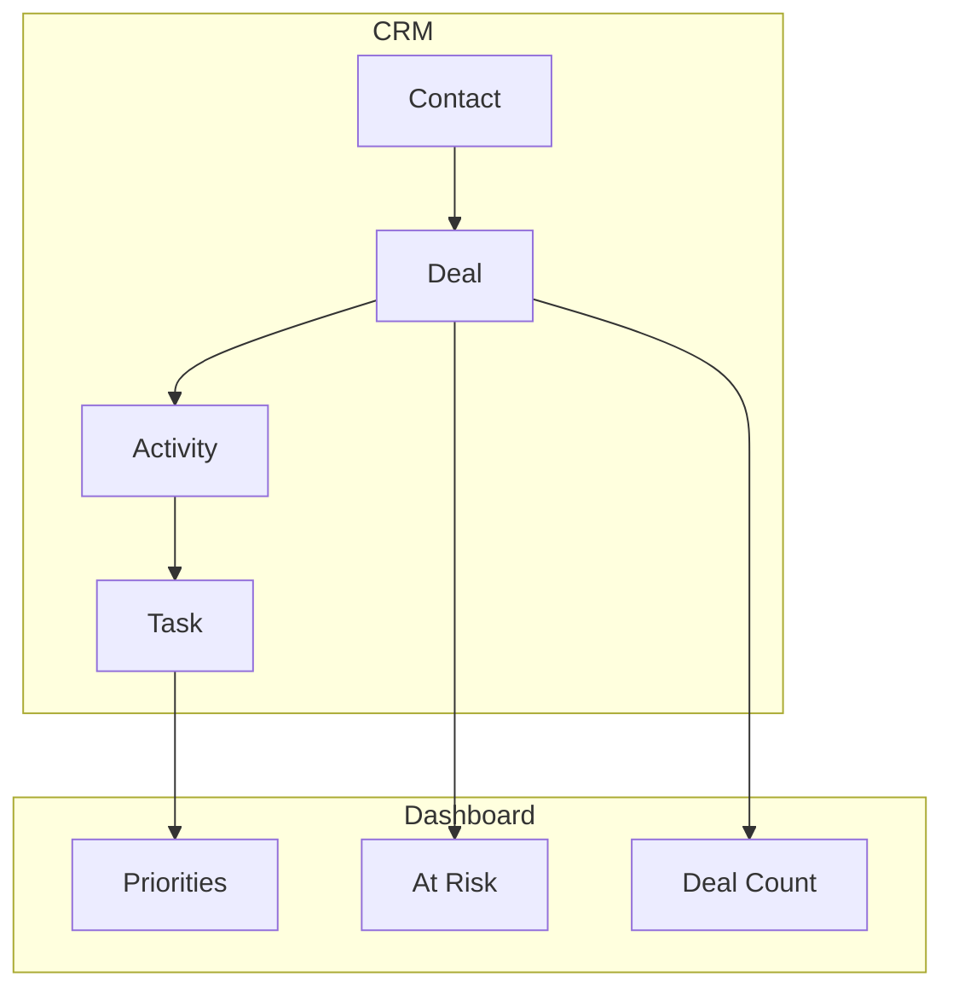
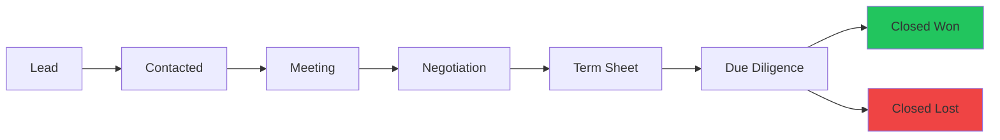

# Phase 6: CRM Integration (Contacts & Deals)

## Purpose
Build the investor/relationship CRM with pipeline management.

## Goals
- Track all investor and key relationships
- Manage fundraising pipeline
- Surface follow-up actions
- Connect to tasks and dashboard

---

## CRM Data Flow



---

## Contacts

### Contact Types
| Type | Icon | Description |
|------|------|-------------|
| investor | 💰 | VCs, angels, family offices |
| customer | 👤 | Current/potential customers |
| advisor | 🎯 | Mentors, advisors |
| partner | 🤝 | Strategic partners |
| other | 📋 | Everyone else |

### Contacts List View
```
┌──────────────────────────────────────────────────────────────┐
│ Contacts                        [+ Add Contact] [🔍 Search]  │
├──────────────────────────────────────────────────────────────┤
│ [All] [Investors] [Customers] [Advisors] [Partners]          │
├──────────────────────────────────────────────────────────────┤
│ ┌──────────────────────────────────────────────────────────┐ │
│ │ 👤 Sarah Chen          Sequoia Capital      💰 Investor  │ │
│ │    Partner             Last: 3 days ago     2 deals      │ │
│ ├──────────────────────────────────────────────────────────┤ │
│ │ 👤 Mike Johnson        Acme Corp           👤 Customer   │ │
│ │    CTO                 Last: 1 week ago     1 deal       │ │
│ └──────────────────────────────────────────────────────────┘ │
└──────────────────────────────────────────────────────────────┘
```

### Contact Detail View
```
┌──────────────────────────────────────────────────────────────┐
│ ← Back          Sarah Chen                    [Edit] [...]   │
├──────────────────────────────────────────────────────────────┤
│                                                              │
│  📧 sarah@sequoia.com           🔗 linkedin.com/in/sarahc   │
│  📱 +1 555-0123                 🏢 Sequoia Capital          │
│                                                              │
├──────────────────────────────────────────────────────────────┤
│  DEALS (2)                                                   │
│  ┌────────────────────────────────────────────────────────┐  │
│  │ Series A - Sequoia     Meeting      $2M    [View →]    │  │
│  │ Advisory Equity        Negotiation  50K    [View →]    │  │
│  └────────────────────────────────────────────────────────┘  │
├──────────────────────────────────────────────────────────────┤
│  TASKS (3)                                                   │
│  ┌────────────────────────────────────────────────────────┐  │
│  │ ☐ Send updated deck              Due: Tomorrow         │  │
│  │ ☐ Schedule follow-up call        Due: Next week        │  │
│  │ ✓ Initial intro meeting          Completed             │  │
│  └────────────────────────────────────────────────────────┘  │
├──────────────────────────────────────────────────────────────┤
│  NOTES                                                       │
│  ┌────────────────────────────────────────────────────────┐  │
│  │ Met at TechCrunch. Interested in AI/ML startups.       │  │
│  │ Prefers product-led growth companies.                  │  │
│  └────────────────────────────────────────────────────────┘  │
└──────────────────────────────────────────────────────────────┘
```

---

## Deals Pipeline

### Deal Stages (Fundraising Flow)



### Pipeline View (Kanban)
```
┌─────────────────────────────────────────────────────────────────────────┐
│ Deal Pipeline                              [+ Add Deal] [List | Kanban] │
├─────────────────────────────────────────────────────────────────────────┤
│                                                                         │
│  Lead        Contacted    Meeting      Negotiation  Term Sheet          │
│  ────        ─────────    ───────      ───────────  ──────────          │
│  ┌─────┐     ┌─────┐      ┌─────┐      ┌─────┐                          │
│  │Deal1│     │Deal2│      │Deal4│      │Deal5│                          │
│  │$500K│     │$1M  │      │$2M  │      │$3M  │                          │
│  └─────┘     └─────┘      └─────┘      └─────┘                          │
│  ┌─────┐     ┌─────┐                                                    │
│  │Deal3│     │Deal6│                                                    │
│  │$750K│     │$500K│                                                    │
│  └─────┘     └─────┘                                                    │
│                                                                         │
├─────────────────────────────────────────────────────────────────────────┤
│ Pipeline Value: $7.75M    Active Deals: 6    Avg Close: 45 days         │
└─────────────────────────────────────────────────────────────────────────┘
```

### Deal Detail View
```
┌──────────────────────────────────────────────────────────────┐
│ ← Back          Series A - Sequoia         [Edit] [Archive] │
├──────────────────────────────────────────────────────────────┤
│                                                              │
│  Stage: [Meeting ▼]                                          │
│                                                              │
│  💰 $2,000,000           📊 40% probability                  │
│  📅 Expected: Mar 2024   ⏱️ Last touch: 3 days ago           │
│                                                              │
├──────────────────────────────────────────────────────────────┤
│  CONTACT                                                     │
│  Sarah Chen - Partner @ Sequoia Capital                      │
├──────────────────────────────────────────────────────────────┤
│  AI INSIGHTS                                                 │
│  ┌────────────────────────────────────────────────────────┐  │
│  │ ⚠️ This deal may be stalling. No activity in 5 days.   │  │
│  │ 💡 Suggested: Send deck update with Q4 metrics         │  │
│  │ [Create Follow-up Task →]                              │  │
│  └────────────────────────────────────────────────────────┘  │
├──────────────────────────────────────────────────────────────┤
│  TASKS                                                       │
│  ☐ Send updated deck                                         │
│  ☐ Prepare data room                                         │
├──────────────────────────────────────────────────────────────┤
│  ACTIVITY TIMELINE                                           │
│  📅 Jan 15 - Initial meeting                                 │
│  📧 Jan 18 - Sent follow-up email                            │
│  📞 Jan 22 - Call scheduled                                  │
└──────────────────────────────────────────────────────────────┘
```

---

## CRM Components

### ContactList
```typescript
interface ContactListProps {
  contacts: Contact[];
  filterType?: ContactType;
  onContactClick: (contact: Contact) => void;
  onAddContact: () => void;
}
```

### ContactCard
```typescript
interface ContactCardProps {
  contact: Contact;
  showDeals?: boolean;
  onClick?: () => void;
}
```

### DealPipeline
```typescript
interface DealPipelineProps {
  deals: Deal[];
  view: 'kanban' | 'list';
  onDealClick: (deal: Deal) => void;
  onStageChange: (dealId: string, stage: DealStage) => void;
}
```

### DealCard
```typescript
interface DealCardProps {
  deal: Deal;
  contact?: Contact;
  onClick?: () => void;
  onDragStart?: () => void;
}
```

---

## CRM → Dashboard Integration

### Stalled Deals Detection
```typescript
function findStalledDeals(deals: Deal[]): RiskItem[] {
  const stalledThreshold = 7; // days
  
  return deals
    .filter(deal => {
      if (!deal.last_touch_at) return true;
      const daysSinceTouch = differenceInDays(new Date(), new Date(deal.last_touch_at));
      return daysSinceTouch >= stalledThreshold;
    })
    .filter(deal => !['closed_won', 'closed_lost'].includes(deal.stage))
    .map(deal => ({
      id: `deal-${deal.id}`,
      type: 'stalled_deal',
      severity: deal.amount > 1000000 ? 'high' : 'medium',
      title: `Stalled: ${deal.name}`,
      description: `No activity in ${stalledThreshold}+ days`,
      entity_id: deal.id,
      entity_type: 'deal',
      action_url: `/app/deals?id=${deal.id}`
    }));
}
```

---

## Success Criteria

- [ ] Contacts can be created/edited/deleted
- [ ] Deals linked to contacts
- [ ] Pipeline view with drag-and-drop
- [ ] Stalled deals appear in dashboard risks
- [ ] Tasks can be created from deal context
- [ ] Last touch date auto-updates on activity
