# Founder OS Flow — Architecture Diagrams (Mermaid)

All diagrams rendered with [Mermaid](https://mermaid.js.org/). Paste into any Mermaid-compatible renderer (GitHub, Notion, VS Code extension, mermaid.live).

---

## 1. Product Flow Chart — End-to-End User Journey

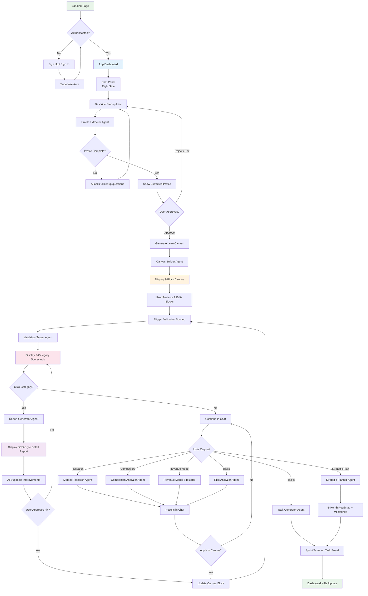
```mermaid
flowchart TD
    A[Landing Page] --> B{Authenticated?}
    B -->|No| C[Sign Up / Sign In]
    C --> D[Supabase Auth]
    D --> B
    B -->|Yes| E[App Dashboard]

    E --> F[Chat Panel<br/>Right Side]
    F --> G[Describe Startup Idea]
    G --> H[Profile Extractor Agent]
    H --> I{Profile Complete?}
    I -->|No| J[AI asks follow-up questions]
    J --> G
    I -->|Yes| K[Show Extracted Profile]

    K --> L{User Approves?}
    L -->|Reject / Edit| G
    L -->|Approve| M[Generate Lean Canvas]

    M --> N[Canvas Builder Agent]
    N --> O[Display 9-Block Canvas]
    O --> P[User Reviews & Edits Blocks]

    P --> Q[Trigger Validation Scoring]
    Q --> R[Validation Scorer Agent]
    R --> S[Display 9-Category Scorecards]

    S --> T{Click Category?}
    T -->|Yes| U[Report Generator Agent]
    U --> V[Display BCG-Style Detail Report]
    V --> W[AI Suggests Improvements]
    W --> X{User Approves Fix?}
    X -->|Yes| Y[Update Canvas Block]
    Y --> Q
    X -->|No| S

    T -->|No| Z[Continue in Chat]
    Z --> AA{User Request}
    AA -->|Research| AB[Market Research Agent]
    AA -->|Competitors| AC[Competition Analyzer Agent]
    AA -->|Revenue Model| AD[Revenue Model Simulator]
    AA -->|Risks| AE[Risk Analyzer Agent]
    AA -->|Strategic Plan| AF[Strategic Planner Agent]
    AA -->|Tasks| AG[Task Generator Agent]

    AB & AC & AD & AE --> AH[Results in Chat]
    AH --> AI{Apply to Canvas?}
    AI -->|Yes| Y
    AI -->|No| Z

    AF --> AJ[6-Month Roadmap + Milestones]
    AG --> AK[Sprint Tasks on Task Board]

    AJ --> AK
    AK --> AL[Dashboard KPIs Update]

    style A fill:#e8f5e9
    style E fill:#e3f2fd
    style O fill:#fff3e0
    style S fill:#fce4ec
    style V fill:#f3e5f5
    style AL fill:#e8f5e9
```

---

## 2. User Journey Map

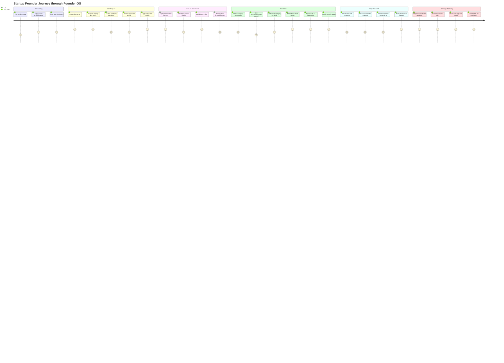
```mermaid
journey
    title Startup Founder Journey through Founder OS
    section Onboarding
      Visit landing page: 3: Founder
      Sign up with email/Google: 4: Founder
      Enter app dashboard: 4: Founder
    section Idea Capture
      Open chat panel: 5: Founder
      Describe startup idea freely: 5: Founder
      AI asks clarifying questions: 4: Founder, AI
      Review extracted profile: 4: Founder
      Approve or edit profile: 5: Founder
    section Canvas Generation
      AI generates Lean Canvas: 5: AI
      Review 9 canvas blocks: 4: Founder
      Edit blocks inline: 5: Founder
      AI suggests improvements: 4: AI
    section Validation
      View 9-category scorecards: 4: Founder
      See red/amber/green scores: 3: Founder
      Click weak category for detail: 4: Founder
      Read BCG-style report: 5: Founder
      Approve AI fix suggestion: 5: Founder
      Watch score improve: 5: Founder
    section Deep Research
      Ask for market research: 4: Founder
      Ask for competitor analysis: 4: Founder
      Review revenue projections: 4: Founder
      Apply findings to canvas: 5: Founder
    section Strategic Planning
      Request investment roadmap: 5: Founder
      Review 6-month plan: 5: Founder
      Tasks auto-populate board: 5: Founder
      Track KPIs on dashboard: 5: Founder
```

---

## 3. System Architecture Diagram

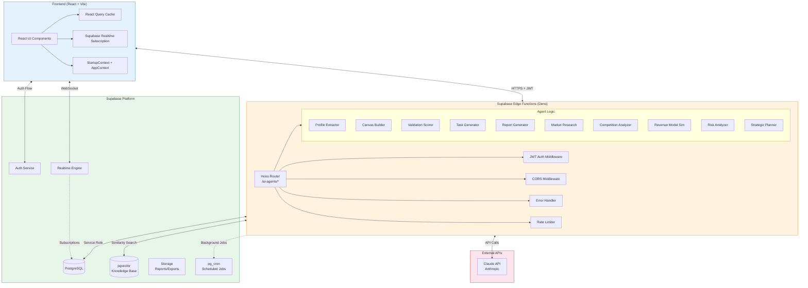
```mermaid
flowchart TB
    subgraph Client["Frontend (React + Vite)"]
        UI[React UI Components]
        RQ[React Query Cache]
        RT[Supabase Realtime Subscription]
        CTX[StartupContext + AppContext]

        UI --> RQ
        UI --> RT
        UI --> CTX
    end

    subgraph Edge["Supabase Edge Functions (Deno)"]
        HONO[Hono Router<br/>/ai-agents/*]
        MW_AUTH[JWT Auth Middleware]
        MW_CORS[CORS Middleware]
        MW_ERR[Error Handler]
        MW_RATE[Rate Limiter]

        HONO --> MW_AUTH
        HONO --> MW_CORS
        HONO --> MW_ERR
        HONO --> MW_RATE

        subgraph Agents["Agent Logic"]
            PE[Profile Extractor]
            LCB[Canvas Builder]
            VS[Validation Scorer]
            TG[Task Generator]
            RG[Report Generator]
            MR[Market Research]
            CA[Competition Analyzer]
            RMS[Revenue Model Sim]
            RA[Risk Analyzer]
            SP[Strategic Planner]
        end

        HONO --> Agents
    end

    subgraph External["External APIs"]
        CLAUDE[Claude API<br/>Anthropic]
    end

    subgraph Supabase["Supabase Platform"]
        AUTH[Auth Service]
        DB[(PostgreSQL)]
        VEC[(pgvector<br/>Knowledge Base)]
        STORE[Storage<br/>Reports/Exports]
        REALTIME[Realtime Engine]
        CRON[pg_cron<br/>Scheduled Jobs]
    end

    Client <-->|HTTPS + JWT| Edge
    Client <-->|WebSocket| REALTIME
    Client <-->|Auth Flow| AUTH

    Edge <-->|Service Role| DB
    Edge <-->|Similarity Search| VEC
    Edge <-->|API Calls| CLAUDE
    Edge -.->|Background Jobs| CRON

    REALTIME -.->|Subscriptions| DB

    style Client fill:#e3f2fd,stroke:#1976d2
    style Edge fill:#fff3e0,stroke:#f57c00
    style External fill:#fce4ec,stroke:#c62828
    style Supabase fill:#e8f5e9,stroke:#388e3c
```

---

## 4. Sequence Diagram — Chat Interaction & Agent Orchestration

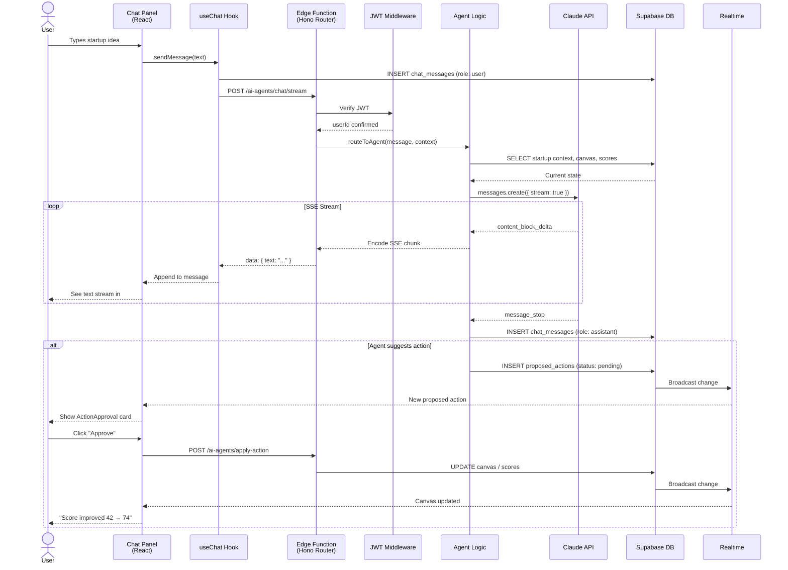
```mermaid
sequenceDiagram
    actor User
    participant Chat as Chat Panel<br/>(React)
    participant Hook as useChat Hook
    participant Edge as Edge Function<br/>(Hono Router)
    participant Auth as JWT Middleware
    participant Agent as Agent Logic
    participant Claude as Claude API
    participant DB as Supabase DB
    participant RT as Realtime

    User->>Chat: Types startup idea
    Chat->>Hook: sendMessage(text)
    Hook->>DB: INSERT chat_messages (role: user)
    Hook->>Edge: POST /ai-agents/chat/stream
    Edge->>Auth: Verify JWT
    Auth-->>Edge: userId confirmed

    Edge->>Agent: routeToAgent(message, context)
    Agent->>DB: SELECT startup context, canvas, scores
    DB-->>Agent: Current state

    Agent->>Claude: messages.create({ stream: true })

    loop SSE Stream
        Claude-->>Agent: content_block_delta
        Agent-->>Edge: Encode SSE chunk
        Edge-->>Hook: data: { text: "..." }
        Hook-->>Chat: Append to message
        Chat-->>User: See text stream in
    end

    Claude-->>Agent: message_stop
    Agent->>DB: INSERT chat_messages (role: assistant)

    alt Agent suggests action
        Agent->>DB: INSERT proposed_actions (status: pending)
        DB->>RT: Broadcast change
        RT-->>Chat: New proposed action
        Chat-->>User: Show ActionApproval card

        User->>Chat: Click "Approve"
        Chat->>Edge: POST /ai-agents/apply-action
        Edge->>DB: UPDATE canvas / scores
        DB->>RT: Broadcast change
        RT-->>Chat: Canvas updated
        Chat-->>User: "Score improved 42 → 74"
    end
```

---

## 5. Sequence Diagram — Background Job Queue (Heavy Agents)

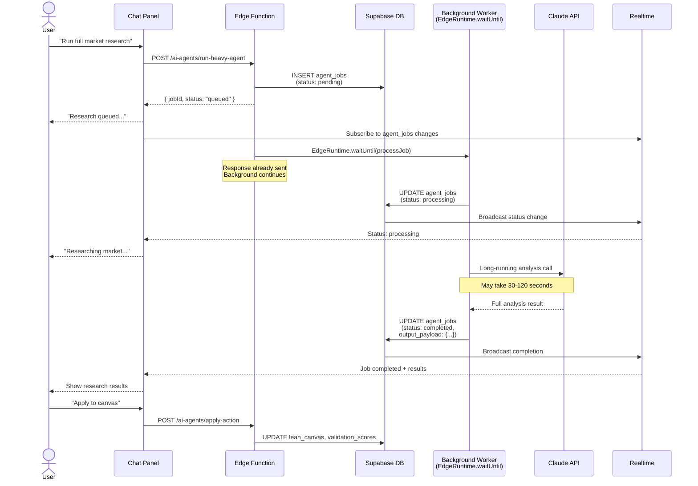
```mermaid
sequenceDiagram
    actor User
    participant Chat as Chat Panel
    participant Edge as Edge Function
    participant DB as Supabase DB
    participant BG as Background Worker<br/>(EdgeRuntime.waitUntil)
    participant Claude as Claude API
    participant RT as Realtime

    User->>Chat: "Run full market research"
    Chat->>Edge: POST /ai-agents/run-heavy-agent
    Edge->>DB: INSERT agent_jobs<br/>(status: pending)
    Edge-->>Chat: { jobId, status: "queued" }
    Chat-->>User: "Research queued..."

    Chat->>RT: Subscribe to agent_jobs changes

    Edge->>BG: EdgeRuntime.waitUntil(processJob)
    Note over Edge: Response already sent<br/>Background continues

    BG->>DB: UPDATE agent_jobs<br/>(status: processing)
    DB->>RT: Broadcast status change
    RT-->>Chat: Status: processing
    Chat-->>User: "Researching market..."

    BG->>Claude: Long-running analysis call
    Note over BG,Claude: May take 30-120 seconds

    Claude-->>BG: Full analysis result

    BG->>DB: UPDATE agent_jobs<br/>(status: completed,<br/>output_payload: {...})
    DB->>RT: Broadcast completion
    RT-->>Chat: Job completed + results
    Chat-->>User: Show research results

    User->>Chat: "Apply to canvas"
    Chat->>Edge: POST /ai-agents/apply-action
    Edge->>DB: UPDATE lean_canvas, validation_scores
```

---

## 6. Entity Relationship Diagram

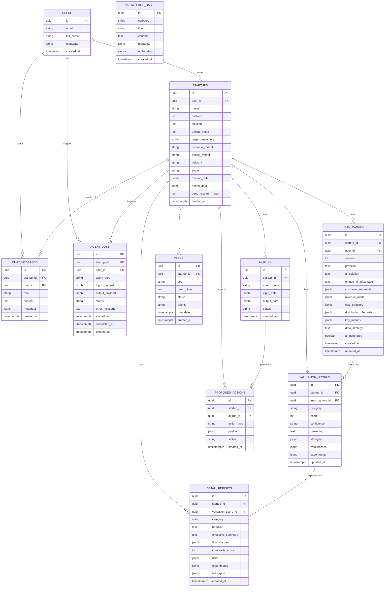
```mermaid
erDiagram
    USERS ||--o{ STARTUPS : owns
    USERS ||--o{ CHAT_MESSAGES : sends
    USERS ||--o{ AGENT_JOBS : triggers

    STARTUPS ||--o{ LEAN_CANVAS : has
    STARTUPS ||--o{ VALIDATION_SCORES : has
    STARTUPS ||--o{ DETAIL_REPORTS : has
    STARTUPS ||--o{ CHAT_MESSAGES : "context for"
    STARTUPS ||--o{ AGENT_JOBS : "target of"
    STARTUPS ||--o{ PROPOSED_ACTIONS : "target of"
    STARTUPS ||--o{ TASKS : has
    STARTUPS ||--o{ AI_RUNS : has

    LEAN_CANVAS ||--o{ VALIDATION_SCORES : "scored by"
    VALIDATION_SCORES ||--o{ DETAIL_REPORTS : "expands into"

    USERS {
        uuid id PK
        string email
        string full_name
        jsonb metadata
        timestamptz created_at
    }

    STARTUPS {
        uuid id PK
        uuid user_id FK
        string name
        text problem
        text solution
        text unique_value
        jsonb target_customers
        string business_model
        string pricing_model
        string industry
        string stage
        jsonb traction_data
        jsonb needs_data
        text deep_research_report
        timestamptz created_at
    }

    LEAN_CANVAS {
        uuid id PK
        uuid startup_id FK
        uuid user_id FK
        int version
        text problem
        text ai_solution
        text unique_ai_advantage
        jsonb customer_segments
        jsonb revenue_model
        jsonb cost_structure
        jsonb distribution_channels
        jsonb key_metrics
        text data_strategy
        boolean ai_generated
        timestamptz created_at
        timestamptz updated_at
    }

    VALIDATION_SCORES {
        uuid id PK
        uuid startup_id FK
        uuid lean_canvas_id FK
        string category
        int score
        string confidence
        text reasoning
        jsonb strengths
        jsonb weaknesses
        jsonb experiments
        timestamptz updated_at
    }

    CHAT_MESSAGES {
        uuid id PK
        uuid startup_id FK
        uuid user_id FK
        string role
        text content
        jsonb metadata
        timestamptz created_at
    }

    DETAIL_REPORTS {
        uuid id PK
        uuid startup_id FK
        uuid validation_score_id FK
        string category
        text headline
        text executive_summary
        jsonb flow_diagram
        int composite_score
        jsonb risks
        jsonb experiments
        jsonb full_report
        timestamptz created_at
    }

    AGENT_JOBS {
        uuid id PK
        uuid startup_id FK
        uuid user_id FK
        string agent_type
        jsonb input_payload
        jsonb output_payload
        string status
        text error_message
        timestamptz started_at
        timestamptz completed_at
        timestamptz created_at
    }

    PROPOSED_ACTIONS {
        uuid id PK
        uuid startup_id FK
        uuid ai_run_id FK
        string action_type
        jsonb payload
        string status
        timestamptz created_at
    }

    KNOWLEDGE_BASE {
        uuid id PK
        string category
        string title
        text content
        jsonb metadata
        vector embedding
        timestamptz created_at
    }

    TASKS {
        uuid id PK
        uuid startup_id FK
        string title
        text description
        string status
        string priority
        timestamptz due_date
        timestamptz created_at
    }

    AI_RUNS {
        uuid id PK
        uuid startup_id FK
        string agent_name
        jsonb input_data
        jsonb output_data
        string status
        timestamptz created_at
    }

    AI_RUNS ||--o{ PROPOSED_ACTIONS : generates
```

---

## 7. Data Flow Diagram

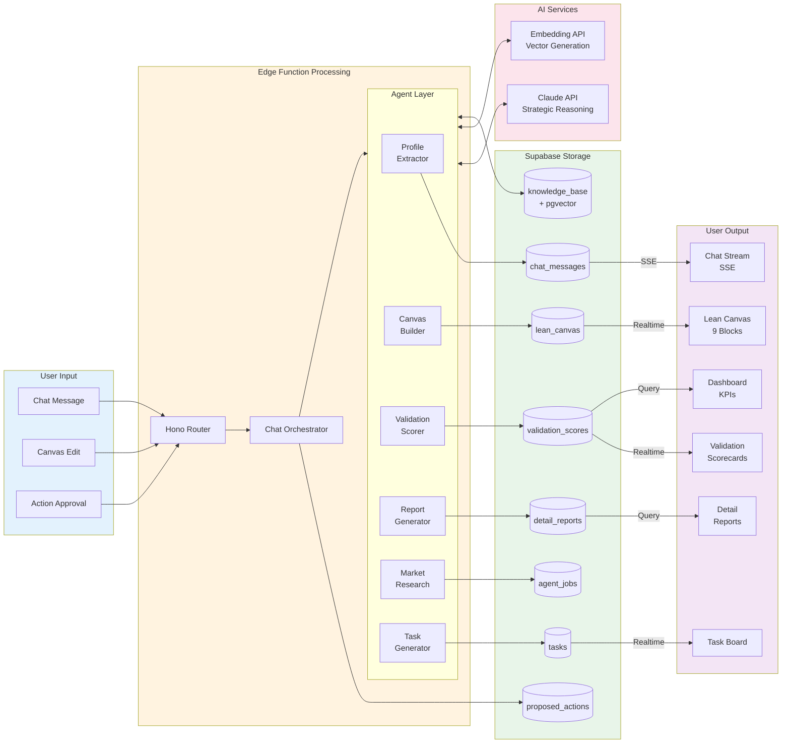
```mermaid
flowchart LR
    subgraph Input["User Input"]
        MSG[Chat Message]
        EDIT[Canvas Edit]
        APPROVE[Action Approval]
    end

    subgraph Processing["Edge Function Processing"]
        ROUTE[Hono Router]
        ORCHESTRATOR[Chat Orchestrator]

        subgraph AgentLayer["Agent Layer"]
            direction TB
            PROFILE[Profile<br/>Extractor]
            CANVAS_AGENT[Canvas<br/>Builder]
            SCORER[Validation<br/>Scorer]
            REPORTER[Report<br/>Generator]
            RESEARCHER[Market<br/>Research]
            TASKER[Task<br/>Generator]
        end

        ORCHESTRATOR --> AgentLayer
    end

    subgraph AI["AI Services"]
        CLAUDE_API[Claude API<br/>Strategic Reasoning]
        EMBED_API[Embedding API<br/>Vector Generation]
    end

    subgraph Storage["Supabase Storage"]
        direction TB
        DB_CANVAS[(lean_canvas)]
        DB_SCORES[(validation_scores)]
        DB_CHAT[(chat_messages)]
        DB_REPORTS[(detail_reports)]
        DB_JOBS[(agent_jobs)]
        DB_KB[(knowledge_base<br/>+ pgvector)]
        DB_TASKS[(tasks)]
        DB_ACTIONS[(proposed_actions)]
    end

    subgraph Output["User Output"]
        CHAT_UI[Chat Stream<br/>SSE]
        CANVAS_UI[Lean Canvas<br/>9 Blocks]
        SCORE_UI[Validation<br/>Scorecards]
        REPORT_UI[Detail<br/>Reports]
        DASH_UI[Dashboard<br/>KPIs]
        TASK_UI[Task Board]
    end

    MSG --> ROUTE --> ORCHESTRATOR
    EDIT --> ROUTE
    APPROVE --> ROUTE

    AgentLayer <--> CLAUDE_API
    AgentLayer <--> EMBED_API
    AgentLayer <--> DB_KB

    PROFILE --> DB_CHAT
    CANVAS_AGENT --> DB_CANVAS
    SCORER --> DB_SCORES
    REPORTER --> DB_REPORTS
    RESEARCHER --> DB_JOBS
    TASKER --> DB_TASKS

    ORCHESTRATOR --> DB_ACTIONS

    DB_CANVAS -->|Realtime| CANVAS_UI
    DB_SCORES -->|Realtime| SCORE_UI
    DB_CHAT -->|SSE| CHAT_UI
    DB_REPORTS -->|Query| REPORT_UI
    DB_SCORES -->|Query| DASH_UI
    DB_TASKS -->|Realtime| TASK_UI

    style Input fill:#e3f2fd
    style Processing fill:#fff3e0
    style AI fill:#fce4ec
    style Storage fill:#e8f5e9
    style Output fill:#f3e5f5
```

---

## 8. Agent State Machine — Job Lifecycle

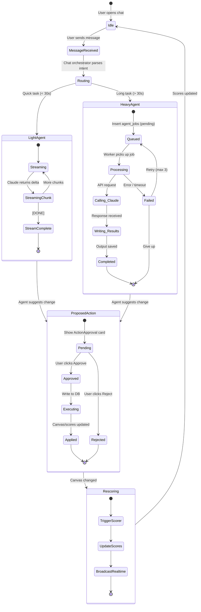
```mermaid
stateDiagram-v2
    [*] --> Idle: User opens chat

    Idle --> MessageReceived: User sends message
    MessageReceived --> Routing: Chat orchestrator parses intent

    Routing --> LightAgent: Quick task (< 30s)
    Routing --> HeavyAgent: Long task (> 30s)

    state LightAgent {
        [*] --> Streaming
        Streaming --> StreamingChunk: Claude returns delta
        StreamingChunk --> Streaming: More chunks
        StreamingChunk --> StreamComplete: [DONE]
        StreamComplete --> [*]
    }

    state HeavyAgent {
        [*] --> Queued: Insert agent_jobs (pending)
        Queued --> Processing: Worker picks up job
        Processing --> Calling_Claude: API request
        Calling_Claude --> Writing_Results: Response received
        Writing_Results --> Completed: Output saved
        Completed --> [*]

        Processing --> Failed: Error / timeout
        Failed --> Queued: Retry (max 3)
        Failed --> [*]: Give up
    }

    LightAgent --> ProposedAction: Agent suggests change
    HeavyAgent --> ProposedAction: Agent suggests change

    state ProposedAction {
        [*] --> Pending: Show ActionApproval card
        Pending --> Approved: User clicks Approve
        Pending --> Rejected: User clicks Reject
        Approved --> Executing: Write to DB
        Executing --> Applied: Canvas/scores updated
        Applied --> [*]
        Rejected --> [*]
    }

    ProposedAction --> Rescoring: Canvas changed
    Rescoring --> Idle: Scores updated

    state Rescoring {
        [*] --> TriggerScorer
        TriggerScorer --> UpdateScores
        UpdateScores --> BroadcastRealtime
        BroadcastRealtime --> [*]
    }
```

---

## 9. Validation Scoring Flow

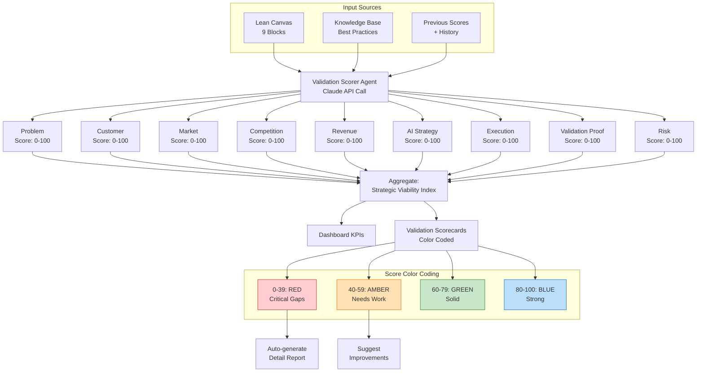
```mermaid
flowchart TD
    subgraph Input["Input Sources"]
        LC[Lean Canvas<br/>9 Blocks]
        KB[Knowledge Base<br/>Best Practices]
        PREV[Previous Scores<br/>+ History]
    end

    LC --> SCORER
    KB --> SCORER
    PREV --> SCORER

    SCORER[Validation Scorer Agent<br/>Claude API Call]

    SCORER --> CAT1[Problem<br/>Score: 0-100]
    SCORER --> CAT2[Customer<br/>Score: 0-100]
    SCORER --> CAT3[Market<br/>Score: 0-100]
    SCORER --> CAT4[Competition<br/>Score: 0-100]
    SCORER --> CAT5[Revenue<br/>Score: 0-100]
    SCORER --> CAT6[AI Strategy<br/>Score: 0-100]
    SCORER --> CAT7[Execution<br/>Score: 0-100]
    SCORER --> CAT8[Validation Proof<br/>Score: 0-100]
    SCORER --> CAT9[Risk<br/>Score: 0-100]

    CAT1 & CAT2 & CAT3 & CAT4 & CAT5 & CAT6 & CAT7 & CAT8 & CAT9 --> AGG[Aggregate:<br/>Strategic Viability Index]

    AGG --> DASH[Dashboard KPIs]
    AGG --> CARDS[Validation Scorecards<br/>Color Coded]

    subgraph Colors["Score Color Coding"]
        RED["0-39: RED<br/>Critical Gaps"]
        AMBER["40-59: AMBER<br/>Needs Work"]
        GREEN["60-79: GREEN<br/>Solid"]
        BLUE["80-100: BLUE<br/>Strong"]
    end

    CARDS --> RED
    CARDS --> AMBER
    CARDS --> GREEN
    CARDS --> BLUE

    RED --> REPORT_R[Auto-generate<br/>Detail Report]
    AMBER --> REPORT_A[Suggest<br/>Improvements]

    style RED fill:#ffcdd2,stroke:#c62828
    style AMBER fill:#ffe0b2,stroke:#ef6c00
    style GREEN fill:#c8e6c9,stroke:#2e7d32
    style BLUE fill:#bbdefb,stroke:#1565c0
```

---

## 10. Component Hierarchy Diagram

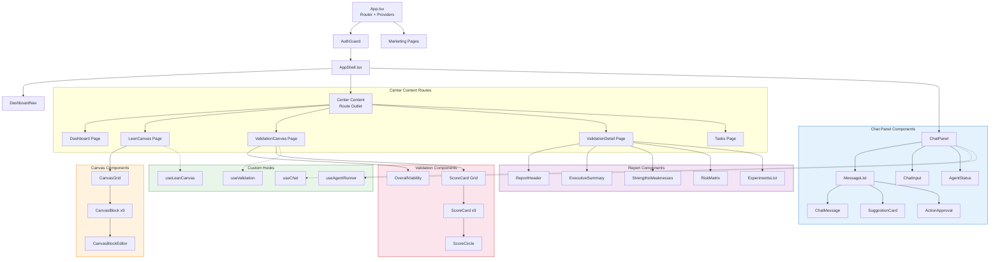
```mermaid
flowchart TD
    APP[App.tsx<br/>Router + Providers]
    APP --> AUTH_GUARD[AuthGuard]
    APP --> MARKETING[Marketing Pages]

    AUTH_GUARD --> SHELL[AppShell.tsx]

    SHELL --> NAV[DashboardNav]
    SHELL --> CONTENT[Center Content<br/>Route Outlet]
    SHELL --> CHAT_PANEL[ChatPanel]

    subgraph ChatComponents["Chat Panel Components"]
        CHAT_PANEL --> MSG_LIST[MessageList]
        MSG_LIST --> CHAT_MSG[ChatMessage]
        MSG_LIST --> SUGGESTION[SuggestionCard]
        MSG_LIST --> ACTION[ActionApproval]
        CHAT_PANEL --> CHAT_INPUT[ChatInput]
        CHAT_PANEL --> AGENT_STATUS[AgentStatus]
    end

    subgraph CenterRoutes["Center Content Routes"]
        CONTENT --> DASHBOARD[Dashboard Page]
        CONTENT --> CANVAS_PAGE[LeanCanvas Page]
        CONTENT --> VALID_PAGE[ValidationCanvas Page]
        CONTENT --> DETAIL_PAGE[ValidationDetail Page]
        CONTENT --> TASKS_PAGE[Tasks Page]
    end

    subgraph CanvasComponents["Canvas Components"]
        CANVAS_PAGE --> CANVAS_GRID[CanvasGrid]
        CANVAS_GRID --> CANVAS_BLOCK[CanvasBlock x9]
        CANVAS_BLOCK --> BLOCK_EDITOR[CanvasBlockEditor]
    end

    subgraph ValidationComponents["Validation Components"]
        VALID_PAGE --> VIABILITY[OverallViability]
        VALID_PAGE --> SCORE_GRID[ScoreCard Grid]
        SCORE_GRID --> SCORE_CARD[ScoreCard x9]
        SCORE_CARD --> SCORE_CIRCLE[ScoreCircle]
    end

    subgraph ReportComponents["Report Components"]
        DETAIL_PAGE --> RPT_HEADER[ReportHeader]
        DETAIL_PAGE --> EXEC_SUM[ExecutiveSummary]
        DETAIL_PAGE --> SW[StrengthsWeaknesses]
        DETAIL_PAGE --> RISK_MTX[RiskMatrix]
        DETAIL_PAGE --> EXPERIMENTS[ExperimentsList]
    end

    subgraph Hooks["Custom Hooks"]
        USE_CHAT[useChat]
        USE_AGENT[useAgentRunner]
        USE_CANVAS[useLeanCanvas]
        USE_VALID[useValidation]
    end

    CHAT_PANEL -.-> USE_CHAT
    CHAT_PANEL -.-> USE_AGENT
    CANVAS_PAGE -.-> USE_CANVAS
    VALID_PAGE -.-> USE_VALID

    style ChatComponents fill:#e3f2fd,stroke:#1976d2
    style CanvasComponents fill:#fff3e0,stroke:#f57c00
    style ValidationComponents fill:#fce4ec,stroke:#c62828
    style ReportComponents fill:#f3e5f5,stroke:#7b1fa2
    style Hooks fill:#e8f5e9,stroke:#388e3c
```

---

## 11. Edge Function Internal Architecture

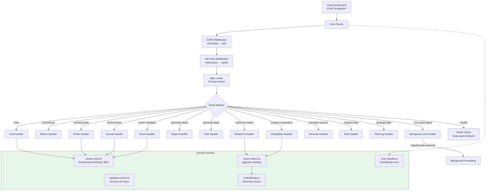
```mermaid
flowchart TD
    REQ[Incoming Request<br/>POST /ai-agents/*] --> HONO[Hono Router]

    HONO --> CORS[CORS Middleware<br/>OPTIONS → 200]
    CORS --> JWT[JWT Auth Middleware<br/>Verify token → userId]
    JWT --> RATE[Rate Limiter<br/>10 req/min/user]

    RATE --> ROUTES{Route Matcher}

    ROUTES -->|/chat| CHAT_H[Chat Handler]
    ROUTES -->|/chat/stream| STREAM_H[Stream Handler]
    ROUTES -->|/extract-profile| PROFILE_H[Profile Handler]
    ROUTES -->|/build-canvas| CANVAS_H[Canvas Handler]
    ROUTES -->|/score-validation| SCORE_H[Score Handler]
    ROUTES -->|/generate-report| REPORT_H[Report Handler]
    ROUTES -->|/generate-tasks| TASK_H[Task Handler]
    ROUTES -->|/research-market| RESEARCH_H[Research Handler]
    ROUTES -->|/analyze-competition| COMP_H[Competition Handler]
    ROUTES -->|/simulate-revenue| REV_H[Revenue Handler]
    ROUTES -->|/analyze-risks| RISK_H[Risk Handler]
    ROUTES -->|/strategic-plan| PLAN_H[Planning Handler]
    ROUTES -->|/run-heavy-agent| HEAVY_H[Background Job Handler]
    ROUTES -->|/health| HEALTH[Health Check<br/>Keep-warm endpoint]

    subgraph Shared["_shared/ modules"]
        CLAUDE_CLIENT[claude-client.ts<br/>Module-level Anthropic SDK]
        SUPA_ADMIN[supabase-admin.ts<br/>Service role client]
        VEC_SEARCH[vector-search.ts<br/>pgvector similarity]
        EMBED[embeddings.ts<br/>Generate vectors]
        ERR[error-handler.ts<br/>Centralized errors]
    end

    CHAT_H & PROFILE_H & CANVAS_H & SCORE_H --> CLAUDE_CLIENT
    RESEARCH_H & COMP_H --> VEC_SEARCH
    VEC_SEARCH --> EMBED
    HEAVY_H -->|EdgeRuntime.waitUntil| BG[Background Processing]

    HONO -.-> ERR

    style Shared fill:#e8f5e9,stroke:#388e3c
```

---

## 12. Phase Dependency & Implementation Timeline

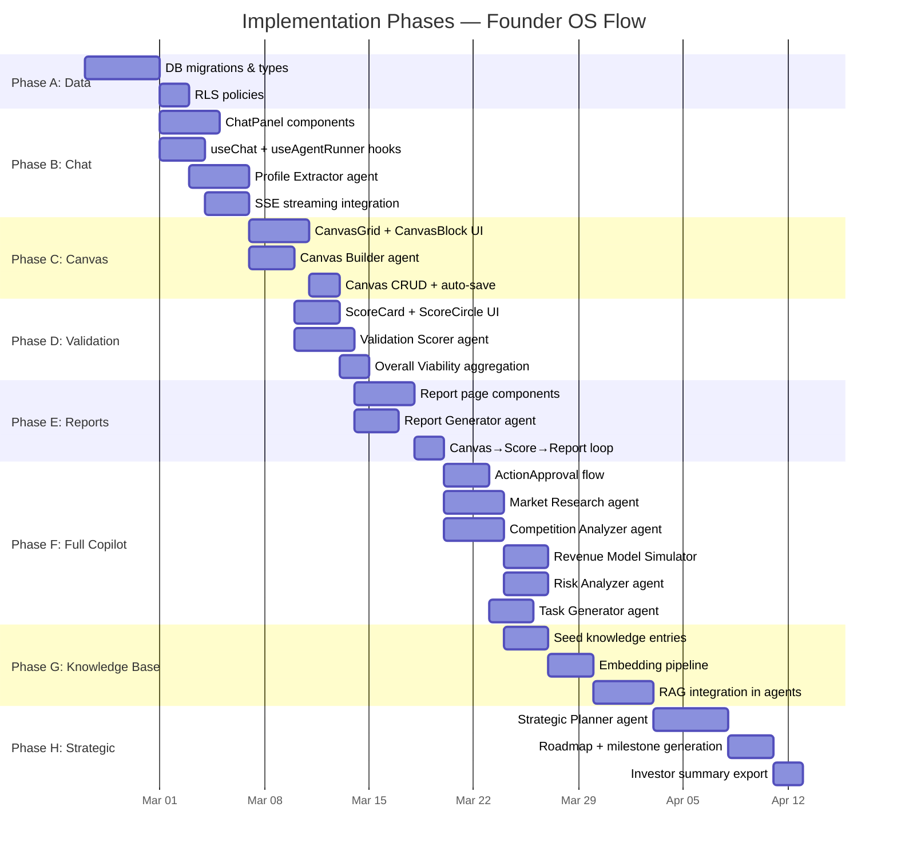
```mermaid
gantt
    title Implementation Phases — Founder OS Flow
    dateFormat YYYY-MM-DD
    axisFormat %b %d

    section Phase A: Data
    DB migrations & types          :a1, 2026-02-24, 5d
    RLS policies                   :a2, after a1, 2d

    section Phase B: Chat
    ChatPanel components           :b1, after a1, 4d
    useChat + useAgentRunner hooks :b2, after a1, 3d
    Profile Extractor agent        :b3, after a2, 4d
    SSE streaming integration      :b4, after b2, 3d

    section Phase C: Canvas
    CanvasGrid + CanvasBlock UI    :c1, after b3, 4d
    Canvas Builder agent            :c2, after b3, 3d
    Canvas CRUD + auto-save        :c3, after c1, 2d

    section Phase D: Validation
    ScoreCard + ScoreCircle UI     :d1, after c2, 3d
    Validation Scorer agent        :d2, after c2, 4d
    Overall Viability aggregation  :d3, after d1, 2d

    section Phase E: Reports
    Report page components         :e1, after d2, 4d
    Report Generator agent         :e2, after d2, 3d
    Canvas→Score→Report loop       :e3, after e1, 2d

    section Phase F: Full Copilot
    ActionApproval flow            :f1, after e3, 3d
    Market Research agent          :f2, after e3, 4d
    Competition Analyzer agent     :f3, after e3, 4d
    Revenue Model Simulator        :f4, after f2, 3d
    Risk Analyzer agent            :f5, after f3, 3d
    Task Generator agent           :f6, after f1, 3d

    section Phase G: Knowledge Base
    Seed knowledge entries         :g1, after f2, 3d
    Embedding pipeline             :g2, after g1, 3d
    RAG integration in agents      :g3, after g2, 4d

    section Phase H: Strategic
    Strategic Planner agent        :h1, after g3, 5d
    Roadmap + milestone generation :h2, after h1, 3d
    Investor summary export        :h3, after h2, 2d
```

---

## 13. AI Propose → User Approve → System Execute Flow

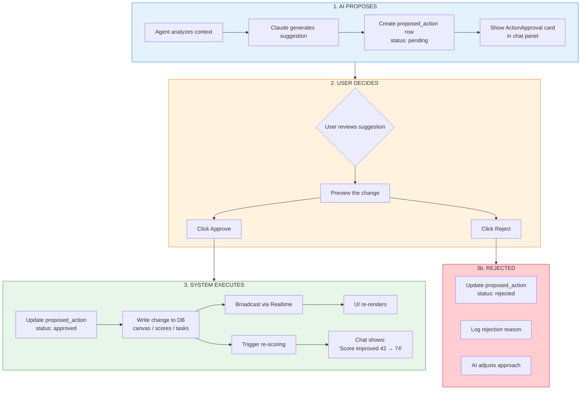
```mermaid
flowchart TD
    subgraph Propose["1. AI PROPOSES"]
        A1[Agent analyzes context]
        A2[Claude generates suggestion]
        A3[Create proposed_action row<br/>status: pending]
        A4[Show ActionApproval card<br/>in chat panel]

        A1 --> A2 --> A3 --> A4
    end

    subgraph Approve["2. USER DECIDES"]
        B1{User reviews suggestion}
        B2[Preview the change]
        B3[Click Approve]
        B4[Click Reject]

        B1 --> B2
        B2 --> B3
        B2 --> B4
    end

    subgraph Execute["3. SYSTEM EXECUTES"]
        C1[Update proposed_action<br/>status: approved]
        C2[Write change to DB<br/>canvas / scores / tasks]
        C3[Broadcast via Realtime]
        C4[UI re-renders]
        C5[Trigger re-scoring]
        C6[Chat shows:<br/>'Score improved 42 → 74']

        C1 --> C2 --> C3 --> C4
        C2 --> C5 --> C6
    end

    subgraph Reject["3b. REJECTED"]
        D1[Update proposed_action<br/>status: rejected]
        D2[Log rejection reason]
        D3[AI adjusts approach]
    end

    Propose --> Approve
    B3 --> Execute
    B4 --> Reject

    style Propose fill:#e3f2fd,stroke:#1976d2
    style Approve fill:#fff3e0,stroke:#f57c00
    style Execute fill:#e8f5e9,stroke:#388e3c
    style Reject fill:#ffcdd2,stroke:#c62828
```

---

## 14. RAG (Retrieval-Augmented Generation) Pipeline

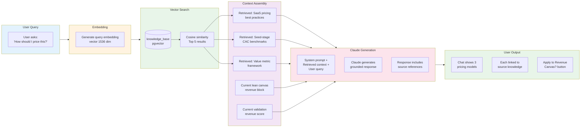
```mermaid
flowchart LR
    subgraph Query["User Query"]
        Q1[User asks:<br/>'How should I price this?']
    end

    subgraph Embed["Embedding"]
        E1[Generate query embedding<br/>vector 1536 dim]
    end

    subgraph Search["Vector Search"]
        S1[(knowledge_base<br/>pgvector)]
        S2[Cosine similarity<br/>Top 5 results]

        S1 --> S2
    end

    subgraph Context["Context Assembly"]
        C1[Retrieved: SaaS pricing<br/>best practices]
        C2[Retrieved: Seed-stage<br/>CAC benchmarks]
        C3[Retrieved: Value metric<br/>framework]
        C4[Current lean canvas<br/>revenue block]
        C5[Current validation<br/>revenue score]
    end

    subgraph Generate["Claude Generation"]
        G1[System prompt +<br/>Retrieved context +<br/>User query]
        G2[Claude generates<br/>grounded response]
        G3[Response includes<br/>source references]
    end

    subgraph Output["User Output"]
        O1[Chat shows 3<br/>pricing models]
        O2[Each linked to<br/>source knowledge]
        O3[Apply to Revenue<br/>Canvas? button]
    end

    Query --> Embed --> Search
    S2 --> C1 & C2 & C3
    C1 & C2 & C3 & C4 & C5 --> Generate
    Generate --> Output

    style Query fill:#e3f2fd
    style Embed fill:#fff3e0
    style Search fill:#e8f5e9
    style Context fill:#f3e5f5
    style Generate fill:#fce4ec
    style Output fill:#e8f5e9
```

---

## 15. Deployment Architecture

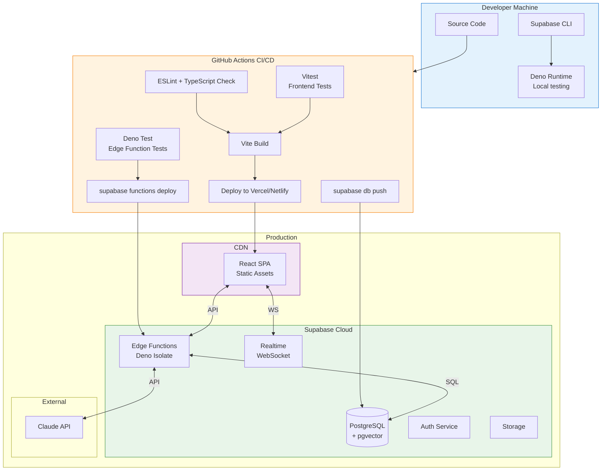
```mermaid
flowchart TB
    subgraph Dev["Developer Machine"]
        CODE[Source Code]
        CLI[Supabase CLI]
        DENO[Deno Runtime<br/>Local testing]
    end

    subgraph CI["GitHub Actions CI/CD"]
        LINT[ESLint + TypeScript Check]
        TEST_FE[Vitest<br/>Frontend Tests]
        TEST_FN[Deno Test<br/>Edge Function Tests]
        BUILD[Vite Build]
        DEPLOY_FN[supabase functions deploy]
        DEPLOY_DB[supabase db push]
        DEPLOY_FE[Deploy to Vercel/Netlify]
    end

    subgraph Prod["Production"]
        subgraph Supabase_Cloud["Supabase Cloud"]
            EDGE_PROD[Edge Functions<br/>Deno Isolate]
            DB_PROD[(PostgreSQL<br/>+ pgvector)]
            AUTH_PROD[Auth Service]
            RT_PROD[Realtime<br/>WebSocket]
            STORE_PROD[Storage]
        end

        subgraph CDN["CDN"]
            FE_PROD[React SPA<br/>Static Assets]
        end

        subgraph External_Prod["External"]
            CLAUDE_PROD[Claude API]
        end
    end

    CODE --> CI
    CLI --> DENO

    LINT --> BUILD
    TEST_FE --> BUILD
    TEST_FN --> DEPLOY_FN
    BUILD --> DEPLOY_FE

    DEPLOY_FN --> EDGE_PROD
    DEPLOY_DB --> DB_PROD
    DEPLOY_FE --> FE_PROD

    FE_PROD <-->|API| EDGE_PROD
    FE_PROD <-->|WS| RT_PROD
    EDGE_PROD <-->|SQL| DB_PROD
    EDGE_PROD <-->|API| CLAUDE_PROD

    style Dev fill:#e3f2fd,stroke:#1976d2
    style CI fill:#fff3e0,stroke:#f57c00
    style Supabase_Cloud fill:#e8f5e9,stroke:#388e3c
    style CDN fill:#f3e5f5,stroke:#7b1fa2
```

---

## 16. Security & Auth Flow

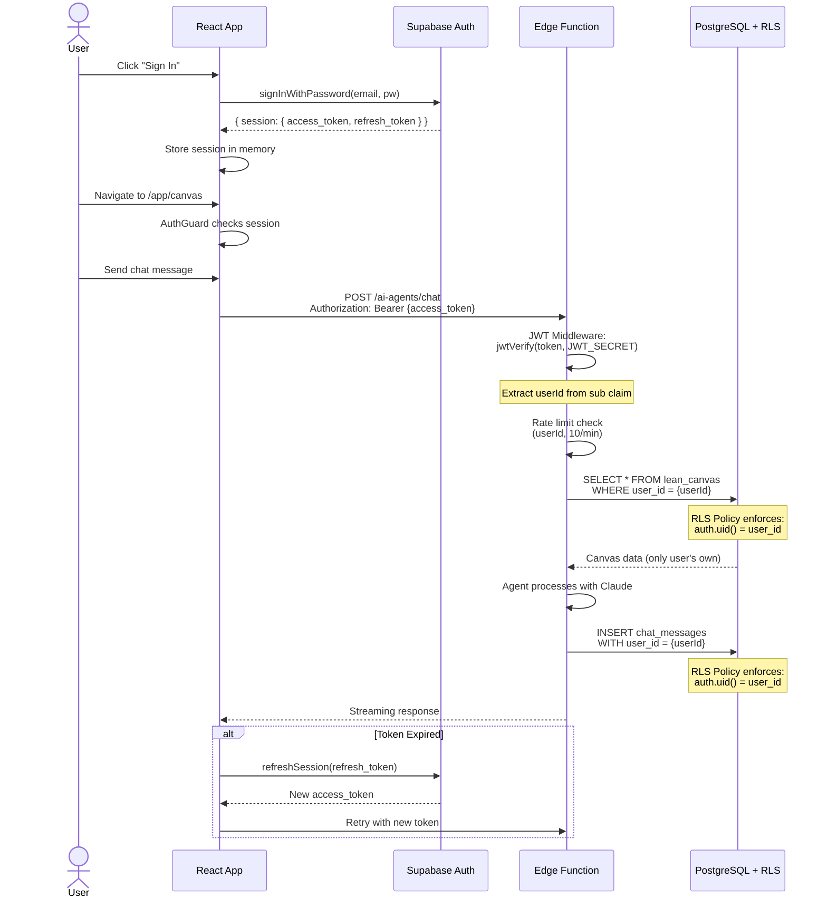
```mermaid
sequenceDiagram
    actor User
    participant App as React App
    participant Auth as Supabase Auth
    participant Edge as Edge Function
    participant DB as PostgreSQL + RLS

    User->>App: Click "Sign In"
    App->>Auth: signInWithPassword(email, pw)
    Auth-->>App: { session: { access_token, refresh_token } }
    App->>App: Store session in memory

    User->>App: Navigate to /app/canvas
    App->>App: AuthGuard checks session

    User->>App: Send chat message
    App->>Edge: POST /ai-agents/chat<br/>Authorization: Bearer {access_token}

    Edge->>Edge: JWT Middleware:<br/>jwtVerify(token, JWT_SECRET)
    Note over Edge: Extract userId from sub claim

    Edge->>Edge: Rate limit check<br/>(userId, 10/min)

    Edge->>DB: SELECT * FROM lean_canvas<br/>WHERE user_id = {userId}
    Note over DB: RLS Policy enforces:<br/>auth.uid() = user_id

    DB-->>Edge: Canvas data (only user's own)

    Edge->>Edge: Agent processes with Claude

    Edge->>DB: INSERT chat_messages<br/>WITH user_id = {userId}
    Note over DB: RLS Policy enforces:<br/>auth.uid() = user_id

    Edge-->>App: Streaming response

    alt Token Expired
        App->>Auth: refreshSession(refresh_token)
        Auth-->>App: New access_token
        App->>Edge: Retry with new token
    end
```

---

## 17. Lean Canvas Block Layout

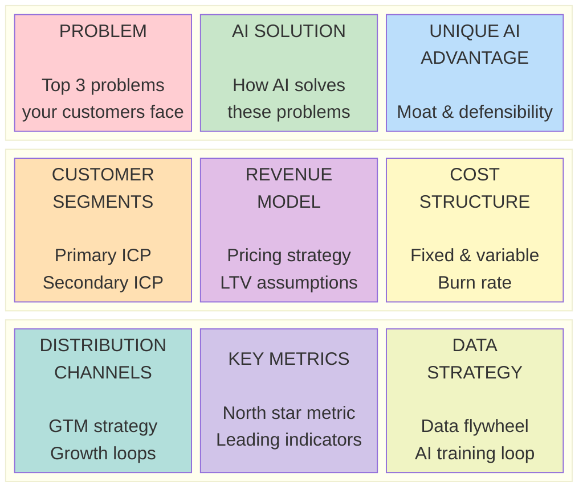
```mermaid
block-beta
    columns 3

    block:row1:3
        columns 3
        Problem["PROBLEM\n\nTop 3 problems\nyour customers face"]
        Solution["AI SOLUTION\n\nHow AI solves\nthese problems"]
        Advantage["UNIQUE AI\nADVANTAGE\n\nMoat & defensibility"]
    end

    block:row2:3
        columns 3
        Customers["CUSTOMER\nSEGMENTS\n\nPrimary ICP\nSecondary ICP"]
        Revenue["REVENUE\nMODEL\n\nPricing strategy\nLTV assumptions"]
        Cost["COST\nSTRUCTURE\n\nFixed & variable\nBurn rate"]
    end

    block:row3:3
        columns 3
        Channels["DISTRIBUTION\nCHANNELS\n\nGTM strategy\nGrowth loops"]
        Metrics["KEY METRICS\n\nNorth star metric\nLeading indicators"]
        Data["DATA\nSTRATEGY\n\nData flywheel\nAI training loop"]
    end

    style Problem fill:#ffcdd2
    style Solution fill:#c8e6c9
    style Advantage fill:#bbdefb
    style Customers fill:#ffe0b2
    style Revenue fill:#e1bee7
    style Cost fill:#fff9c4
    style Channels fill:#b2dfdb
    style Metrics fill:#d1c4e9
    style Data fill:#f0f4c3
```

---

## Additional Suggested Diagrams

Here are more diagrams you could add depending on needs:

| # | Diagram Type | Description | Use Case |
|---|-------------|-------------|----------|
| 18 | **C4 Context Diagram** | Shows system boundaries and external actors | Architecture documentation for stakeholders |
| 19 | **Swimlane Diagram** | User vs AI vs System responsibilities per action | Defining ownership in the propose→approve→execute pattern |
| 20 | **Network Topology** | Supabase regions, CDN nodes, API gateway | DevOps and latency optimization |
| 21 | **Cost Flow Diagram** | Claude API tokens per agent, Supabase compute hours | Budget planning and pricing model |
| 22 | **Feature Flag Matrix** | Which agents are free vs premium tier | Product tier planning |
| 23 | **Error Recovery Flowchart** | What happens on agent timeout, API failure, rate limit | Reliability engineering |
| 24 | **Realtime Subscription Map** | Which tables broadcast to which UI components | Debugging subscription issues |
| 25 | **Prompt Chain Diagram** | How system prompts build on each other across agents | Prompt engineering documentation |
| 26 | **User Persona Map** | Different founder types and their unique flows | UX research |
| 27 | **A/B Test Decision Tree** | Which scoring algorithm variants to test | Product experimentation |
