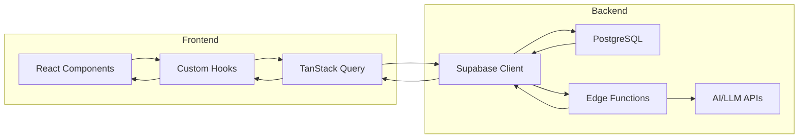
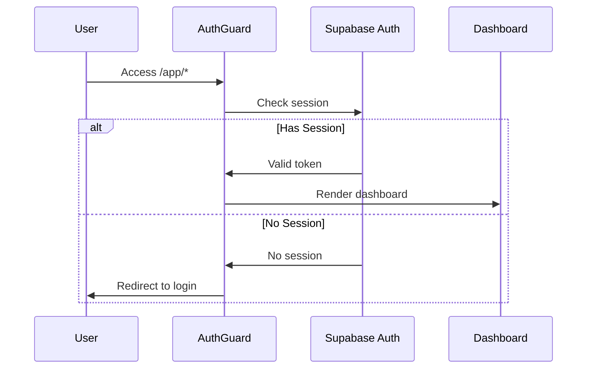
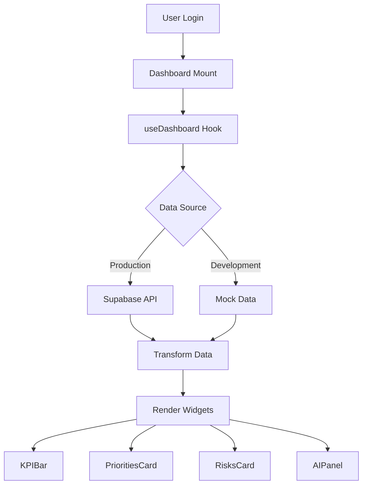

# StartupAI — Complete Sitemap & Architecture Reference

> Generated: 2026-01-14  
> Project: StartupAI (Founder OS)

---

## 📊 Tech Stack & Versions

### Core Framework
| Technology | Version | Purpose |
|-----------|---------|---------|
| React | ^18.3.1 | UI Framework |
| Vite | (latest) | Build Tool & Dev Server |
| TypeScript | (tsconfig) | Type Safety |
| React Router DOM | ^6.30.1 | Client-side Routing |

### State & Data
| Technology | Version | Purpose |
|-----------|---------|---------|
| TanStack React Query | ^5.83.0 | Server State Management |
| Supabase JS | ^2.90.1 | Backend-as-a-Service |
| Zod | ^3.25.76 | Schema Validation |
| React Hook Form | ^7.61.1 | Form State Management |

### UI Component Libraries
| Library | Version | Purpose |
|---------|---------|---------|
| Radix UI | Various (^1.x - ^2.x) | Headless UI Primitives |
| shadcn/ui | Built on Radix | Styled Component Library |
| Lucide React | ^0.462.0 | Icon Library |
| Framer Motion | ^12.26.2 | Animation Library |
| Recharts | ^2.15.4 | Chart Library |
| Embla Carousel | ^8.6.0 | Carousel Component |
| Vaul | ^0.9.9 | Drawer Component |
| CMDK | ^1.1.1 | Command Palette |
| Sonner | ^1.7.4 | Toast Notifications |

### Styling
| Technology | Version | Purpose |
|-----------|---------|---------|
| Tailwind CSS | ^3.x | Utility-first CSS |
| tailwindcss-animate | ^1.0.7 | Animation Utilities |
| class-variance-authority | ^0.7.1 | Variant Styling |
| clsx | ^2.1.1 | Class Name Utility |
| tailwind-merge | ^2.6.0 | Tailwind Class Merging |

### Development & Testing
| Technology | Version | Purpose |
|-----------|---------|---------|
| Vitest | (vitest.config.ts) | Unit Testing |
| ESLint | (eslint.config.js) | Code Linting |
| PostCSS | (postcss.config.js) | CSS Processing |

### Backend (Supabase)
| Service | Project ID | Purpose |
|---------|------------|---------|
| Supabase | ouverjherohazwadfgud | Auth, Database, Edge Functions |
| PostgreSQL | Managed | Relational Database |
| Edge Functions | Deno | Serverless API |

---

## 🗂️ Directory Structure

```
startupai/
├── docs/                           # Documentation
│   ├── supabase/                   # Supabase reference docs
│   │   ├── 00-credentials.md
│   │   ├── 01-tables-reference.md
│   │   └── 02-common-patterns.md
│   ├── 00-dashboard-overview.md    # Master implementation plan
│   ├── 01-phase-foundation.md      # Auth, Layout, Routes spec
│   ├── 02-phase-data-layer.md      # Schema, Types, RLS
│   ├── 03-phase-edge-functions.md  # Edge function specs
│   ├── 04-phase-dashboard-ui.md    # Widget component specs
│   ├── 05-phase-task-system.md     # 5-step workflow spec
│   ├── 06-phase-crm.md             # CRM integration spec
│   ├── 07-phase-ai-panel.md        # AI intelligence spec
│   └── 08-phase-polish.md          # Polish & launch spec
│
├── public/                         # Static assets
│   ├── favicon.ico
│   ├── placeholder.svg
│   └── robots.txt
│
├── src/                            # Source code
│   ├── components/                 # React components
│   │   ├── dashboard/              # Dashboard-specific components
│   │   │   ├── shared/             # Shared dashboard utilities
│   │   │   │   ├── PriorityBadge.tsx
│   │   │   │   └── StatusBadge.tsx
│   │   │   ├── widgets/            # Dashboard widgets
│   │   │   │   ├── EmptyState.tsx
│   │   │   │   └── KPICard.tsx
│   │   │   ├── AIPanel.tsx
│   │   │   ├── AppShell.tsx        # Main layout wrapper
│   │   │   ├── AuthGuard.tsx
│   │   │   ├── DashboardHeader.tsx
│   │   │   ├── DashboardNav.tsx
│   │   │   ├── KPIBar.tsx
│   │   │   ├── PrioritiesCard.tsx
│   │   │   ├── QuickActionsGrid.tsx
│   │   │   └── RisksCard.tsx
│   │   ├── features/               # Feature page sections
│   │   │   ├── FeatureCRM.tsx
│   │   │   ├── FeatureCommunication.tsx
│   │   │   ├── FeatureEvents.tsx
│   │   │   ├── FeatureHiring.tsx
│   │   │   ├── FeatureInvestorSearch.tsx
│   │   │   ├── FeaturePitchDeck.tsx
│   │   │   ├── FeatureProjectManagement.tsx
│   │   │   ├── FeaturesBenefits.tsx
│   │   │   ├── FeaturesCTA.tsx
│   │   │   └── FeaturesHero.tsx
│   │   ├── how-it-works/           # How It Works sections
│   │   │   ├── AICoach.tsx
│   │   │   ├── DailyDashboard.tsx
│   │   │   ├── FeaturesOverview.tsx
│   │   │   ├── FlowSummary.tsx
│   │   │   ├── HowItWorksCTA.tsx
│   │   │   ├── HowItWorksHero.tsx
│   │   │   ├── StrategyEngine.tsx
│   │   │   └── StrategySession.tsx
│   │   ├── sections/               # Landing page sections
│   │   │   ├── Benefits.tsx
│   │   │   ├── Features.tsx
│   │   │   ├── Footer.tsx
│   │   │   ├── Hero.tsx
│   │   │   ├── Problem.tsx
│   │   │   ├── Process.tsx
│   │   │   └── Solution.tsx
│   │   ├── ui/                     # shadcn/ui components (50+)
│   │   │   ├── accordion.tsx
│   │   │   ├── button.tsx
│   │   │   ├── card.tsx
│   │   │   ├── dialog.tsx
│   │   │   ├── form.tsx
│   │   │   ├── input.tsx
│   │   │   ├── table.tsx
│   │   │   ├── tabs.tsx
│   │   │   └── ... (50 total UI primitives)
│   │   ├── Header.tsx              # Global header
│   │   └── NavLink.tsx             # Navigation link component
│   │
│   ├── contexts/                   # React contexts
│   │   └── AppContext.tsx          # User/Org state provider
│   │
│   ├── data/                       # Mock data
│   │   └── mockData.ts             # Development mock data
│   │
│   ├── hooks/                      # Custom React hooks
│   │   ├── use-mobile.tsx          # Mobile detection
│   │   ├── use-toast.ts            # Toast notifications
│   │   ├── useAIInsights.ts        # AI insights data
│   │   └── useDashboard.ts         # Dashboard data
│   │
│   ├── integrations/               # External integrations
│   │   └── supabase/
│   │       ├── client.ts           # Supabase client init
│   │       └── types.ts            # Generated DB types
│   │
│   ├── lib/                        # Utility libraries
│   │   ├── supabase.ts             # Supabase helper
│   │   └── utils.ts                # General utilities (cn, etc.)
│   │
│   ├── pages/                      # Route pages
│   │   ├── app/                    # Dashboard app pages
│   │   │   ├── CompanyProfile.tsx
│   │   │   ├── Contacts.tsx
│   │   │   ├── Dashboard.tsx
│   │   │   ├── Deals.tsx
│   │   │   ├── Profile.tsx
│   │   │   ├── ProjectDetail.tsx
│   │   │   ├── Projects.tsx
│   │   │   ├── Settings.tsx
│   │   │   └── Tasks.tsx
│   │   ├── Features.tsx            # Marketing features page
│   │   ├── HowItWorks.tsx          # Marketing how-it-works
│   │   ├── Index.tsx               # Landing page
│   │   └── NotFound.tsx            # 404 page
│   │
│   ├── test/                       # Test files
│   │   ├── example.test.ts
│   │   └── setup.ts
│   │
│   ├── types/                      # TypeScript types
│   │   └── dashboard.ts            # Dashboard data types
│   │
│   ├── App.css                     # App-specific styles
│   ├── App.tsx                     # Root component & routes
│   ├── index.css                   # Global styles & design tokens
│   ├── main.tsx                    # Entry point
│   └── vite-env.d.ts               # Vite type declarations
│
├── supabase/                       # Supabase configuration
│   └── config.toml                 # Project configuration
│
├── .gitignore
├── CHANGELOG.md                    # Version history
├── README.md                       # Project readme
├── bun.lockb                       # Bun lockfile
├── components.json                 # shadcn/ui config
├── eslint.config.js                # ESLint configuration
├── index.html                      # HTML entry point
├── package.json                    # Dependencies
├── postcss.config.js               # PostCSS configuration
├── tailwind.config.ts              # Tailwind configuration
├── tsconfig.json                   # TypeScript configuration
├── vite.config.ts                  # Vite configuration
└── vitest.config.ts                # Vitest configuration
```

---

## 🗺️ Sitemap Tree

### Frontend Routes

```
/                                   # Landing Page (Marketing)
├── /how-it-works                   # How It Works (Marketing)
├── /features                       # Features Page (Marketing)
│
├── /app                            # Dashboard App (Protected)
│   ├── /app/dashboard              # Main Dashboard
│   ├── /app/tasks                  # Task Hub
│   ├── /app/projects               # Projects List
│   │   └── /app/projects/:id       # Project Detail
│   ├── /app/contacts               # CRM Contacts
│   ├── /app/deals                  # Deal Pipeline
│   ├── /app/profile                # User Profile
│   ├── /app/company                # Company Profile
│   └── /app/settings               # App Settings
│
└── /*                              # 404 Not Found
```

### Backend Endpoints (Supabase)

```
Supabase Project: ouverjherohazwadfgud
Base URL: https://ouverjherohazwadfgud.supabase.co

/auth/v1/                           # Authentication
├── /signup                         # User registration
├── /token                          # Token exchange
├── /user                           # User info
└── /logout                         # Session termination

/rest/v1/                           # Database REST API
├── /profiles                       # User profiles
├── /orgs                           # Organizations
├── /startups                       # Startup entities
├── /tasks                          # Tasks table
├── /crm_contacts                   # CRM contacts
├── /crm_deals                      # CRM deals
├── /crm_accounts                   # CRM accounts
├── /projects                       # Projects
├── /decks                          # Pitch decks
├── /slides                         # Deck slides
├── /accelerators                   # Accelerator programs
├── /accelerator_applications       # Applications
└── ... (46+ tables)

/functions/v1/                      # Edge Functions (Planned)
├── /dashboard-summary              # Dashboard data aggregation
└── /ai-insights                    # AI-powered insights
```

---

## 🔀 Router Setup

### Router Configuration (src/App.tsx)

```tsx
import { BrowserRouter, Routes, Route } from "react-router-dom";

<BrowserRouter>
  <Routes>
    {/* Marketing Pages */}
    <Route path="/" element={<Index />} />
    <Route path="/how-it-works" element={<HowItWorks />} />
    <Route path="/features" element={<Features />} />
    
    {/* Dashboard App - Nested Routes */}
    <Route path="/app" element={<AppShell />}>
      <Route path="dashboard" element={<Dashboard />} />
      <Route path="tasks" element={<Tasks />} />
      <Route path="projects" element={<Projects />} />
      <Route path="projects/:id" element={<ProjectDetail />} />
      <Route path="contacts" element={<Contacts />} />
      <Route path="deals" element={<Deals />} />
      <Route path="profile" element={<Profile />} />
      <Route path="company" element={<CompanyProfile />} />
      <Route path="settings" element={<Settings />} />
    </Route>
    
    {/* Catch-all */}
    <Route path="*" element={<NotFound />} />
  </Routes>
</BrowserRouter>
```

### Route Types

| Route Type | Pattern | Layout | Auth Required |
|------------|---------|--------|---------------|
| Marketing | `/`, `/features`, `/how-it-works` | None (standalone) | No |
| Dashboard | `/app/*` | AppShell (3-panel) | Yes (planned) |
| Catch-all | `*` | None | No |

---

## 📦 Import Path Aliases

### Configured Aliases (vite.config.ts & tsconfig.json)

```typescript
// Path alias configuration
{
  "@": "./src"
}
```

### Common Import Patterns

```typescript
// Components
import { Button } from "@/components/ui/button";
import { AppShell } from "@/components/dashboard/AppShell";
import { Header } from "@/components/Header";

// Hooks
import { useDashboard } from "@/hooks/useDashboard";
import { useAIInsights } from "@/hooks/useAIInsights";
import { useToast } from "@/hooks/use-toast";

// Contexts
import { useApp } from "@/contexts/AppContext";

// Data & Types
import { mockTasks, mockDeals } from "@/data/mockData";
import type { Task, Deal, Contact } from "@/types/dashboard";

// Integrations
import { supabase } from "@/integrations/supabase/client";

// Utilities
import { cn } from "@/lib/utils";
```

---

## 🔄 Application Workflows

### User Workflows

```mermaid
flowchart TD
    subgraph Marketing
        A[Landing Page] --> B{CTA Click}
        B -->|How It Works| C[/how-it-works]
        B -->|Features| D[/features]
        B -->|Get Started| E[/app/dashboard]
    end
    
    subgraph Dashboard
        E --> F{Navigation}
        F -->|Tasks| G[/app/tasks]
        F -->|Projects| H[/app/projects]
        F -->|Contacts| I[/app/contacts]
        F -->|Deals| J[/app/deals]
        F -->|Settings| K[/app/settings]
        
        H --> L[/app/projects/:id]
    end
```

### Data Flow



### Authentication Flow (Planned)



### Dashboard Data Workflow



---

## 🎨 Design System

### Color Tokens (index.css)

| Token | Light Mode | Dark Mode | Usage |
|-------|------------|-----------|-------|
| `--background` | Warm Ivory | Dark Charcoal | Page background |
| `--foreground` | Charcoal | Light Ivory | Primary text |
| `--primary` | Charcoal | Light | CTAs, emphasis |
| `--secondary` | Sage | Dark Sage | Secondary actions |
| `--accent` | Gold | Muted Gold | Highlights |
| `--muted` | Light Cream | Dark Gray | Disabled/subtle |
| `--destructive` | Red | Dark Red | Errors/warnings |

### Typography

| Class | Font | Usage |
|-------|------|-------|
| `font-serif` | Cormorant Garamond | Headings |
| `font-sans` | Inter | Body text |
| `.heading-display` | Serif 4xl-7xl | Hero headlines |
| `.heading-section` | Serif 3xl-5xl | Section titles |
| `.heading-card` | Serif xl-2xl | Card titles |
| `.body-large` | Sans lg-xl | Lead paragraphs |
| `.body-base` | Sans base | Body text |

### Component Classes

| Class | Purpose |
|-------|---------|
| `.card-elevated` | Cards with shadow |
| `.card-soft` | Subtle cards with blur |
| `.section-padding` | Consistent section spacing |
| `.container-narrow` | Max-width 5xl container |
| `.container-wide` | Max-width 7xl container |
| `.gold-gradient` | Gold gradient background |
| `.sage-gradient` | Sage gradient background |

---

## 🏗️ Component Architecture

### Layout Hierarchy

```
App.tsx
├── QueryClientProvider (TanStack Query)
│   └── TooltipProvider (Radix)
│       └── AppProvider (App Context)
│           └── BrowserRouter
│               └── Routes
│                   ├── Index (Marketing)
│                   ├── HowItWorks (Marketing)
│                   ├── Features (Marketing)
│                   └── AppShell (Dashboard Layout)
│                       ├── DashboardHeader
│                       ├── DashboardNav (Left)
│                       ├── Outlet (Content)
│                       └── AIPanel (Right)
```

### Dashboard 3-Panel Layout

```
┌────────────────────────────────────────────────────────────────┐
│                       DashboardHeader                          │
├──────────────┬─────────────────────────────────┬──────────────┤
│              │                                 │              │
│ DashboardNav │       Main Content Area         │   AIPanel    │
│   (w-64)     │        (flex-1)                 │   (w-80)     │
│              │                                 │              │
│  - Dashboard │    ┌─────────────────────┐     │  - Summary   │
│  - Tasks     │    │  KPIBar             │     │  - Next Steps│
│  - Projects  │    ├─────────────────────┤     │  - Risks     │
│  - Contacts  │    │  PrioritiesCard     │     │              │
│  - Deals     │    ├─────────────────────┤     │              │
│  - Settings  │    │  RisksCard          │     │              │
│              │    └─────────────────────┘     │              │
│              │                                 │              │
└──────────────┴─────────────────────────────────┴──────────────┘

Breakpoints:
- Desktop (xl+): 3 panels visible
- Tablet (lg): Nav + Content, AI Panel hidden
- Mobile (<lg): Content only, Nav in drawer
```

---

## 📋 Page Inventory

### Marketing Pages (3)

| Page | Route | Components |
|------|-------|------------|
| Landing | `/` | Hero, Problem, Solution, Features, Process, Benefits, Footer |
| How It Works | `/how-it-works` | HowItWorksHero, StrategySession, StrategyEngine, DailyDashboard, AICoach, FeaturesOverview, FlowSummary, HowItWorksCTA |
| Features | `/features` | FeaturesHero, FeatureCRM, FeaturePitchDeck, FeatureEvents, FeatureHiring, FeatureInvestorSearch, FeatureProjectManagement, FeatureCommunication, FeaturesBenefits, FeaturesCTA |

### Dashboard Pages (9)

| Page | Route | Purpose | Status |
|------|-------|---------|--------|
| Dashboard | `/app/dashboard` | Main overview with KPIs, priorities, risks | ✅ Done |
| Tasks | `/app/tasks` | Task hub with filters | ✅ Done |
| Projects | `/app/projects` | Project list with health indicators | ✅ Done |
| Project Detail | `/app/projects/:id` | Single project with tasks | ✅ Done |
| Contacts | `/app/contacts` | CRM contact list | ✅ Done |
| Deals | `/app/deals` | Pipeline view | ✅ Done |
| Profile | `/app/profile` | User settings | ✅ Done |
| Company | `/app/company` | Org settings | ✅ Done |
| Settings | `/app/settings` | App preferences | ✅ Done |

---

## 🗄️ Database Tables (46+)

### Core Tables

| Table | Purpose | Key Fields |
|-------|---------|------------|
| `profiles` | User profiles | id, email, full_name, org_id |
| `orgs` | Organizations | id, name, slug |
| `startups` | Startup entities | id, name, stage, org_id |
| `tasks` | Task items | id, title, status, phase, startup_id |
| `projects` | Project groupings | id, name, health, startup_id |

### CRM Tables

| Table | Purpose | Key Fields |
|-------|---------|------------|
| `crm_contacts` | Contact records | id, first_name, email, startup_id |
| `crm_deals` | Deal pipeline | id, name, stage, amount, startup_id |
| `crm_accounts` | Company accounts | id, name, domain, startup_id |
| `crm_tasks` | CRM-specific tasks | id, title, deal_id, contact_id |
| `crm_activities` | Activity log | id, activity_type, occurred_at |

### AI Tables

| Table | Purpose | Key Fields |
|-------|---------|------------|
| `ai_coach_insights` | AI recommendations | id, insights, recommendations |
| `ai_runs` | AI execution log | id, tool_name, status |
| `proposed_actions` | AI action proposals | id, action_type, payload |
| `action_executions` | Executed actions | id, execution_status, result |

### Content Tables

| Table | Purpose | Key Fields |
|-------|---------|------------|
| `decks` | Pitch decks | id, title, template, org_id |
| `slides` | Deck slides | id, deck_id, position, content |
| `documents` | Document storage | id, document_type, content |
| `events` | Calendar events | id, title, starts_at, ends_at |

See `docs/supabase/01-tables-reference.md` for complete reference.

---

## 🚀 Development Commands

```bash
# Install dependencies
npm install

# Start development server
npm run dev

# Build for production
npm run build

# Preview production build
npm run preview

# Run tests
npm run test

# Lint code
npm run lint
```

---

## 📝 Related Documentation

- [Dashboard Overview](./00-dashboard-overview.md)
- [Phase 1: Foundation](./01-phase-foundation.md)
- [Phase 2: Data Layer](./02-phase-data-layer.md)
- [Phase 3: Edge Functions](./03-phase-edge-functions.md)
- [Phase 4: Dashboard UI](./04-phase-dashboard-ui.md)
- [Phase 5: Task System](./05-phase-task-system.md)
- [Phase 6: CRM Integration](./06-phase-crm.md)
- [Phase 7: AI Panel](./07-phase-ai-panel.md)
- [Phase 8: Polish](./08-phase-polish.md)
- [Supabase Credentials](./supabase/00-credentials.md)
- [Supabase Tables](./supabase/01-tables-reference.md)
- [Supabase Patterns](./supabase/02-common-patterns.md)
